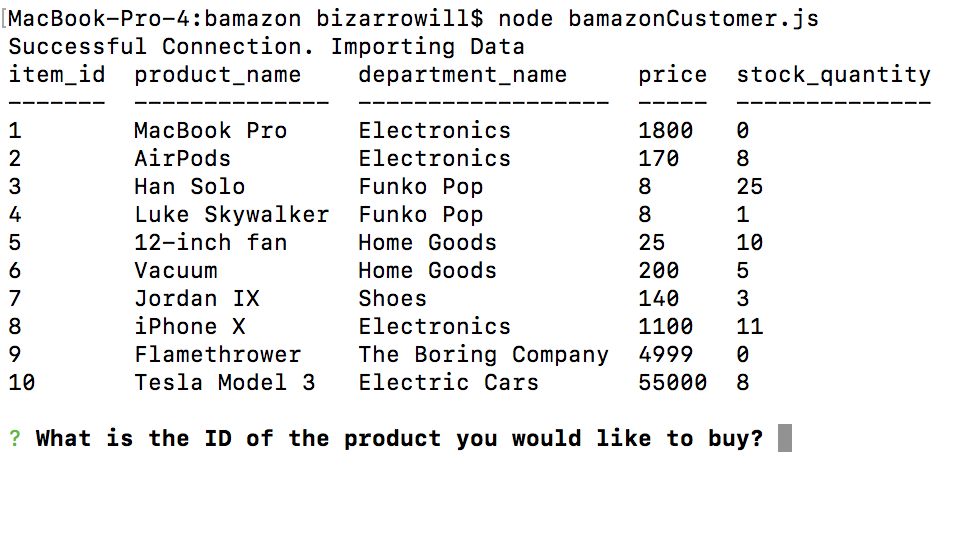
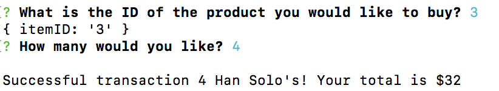
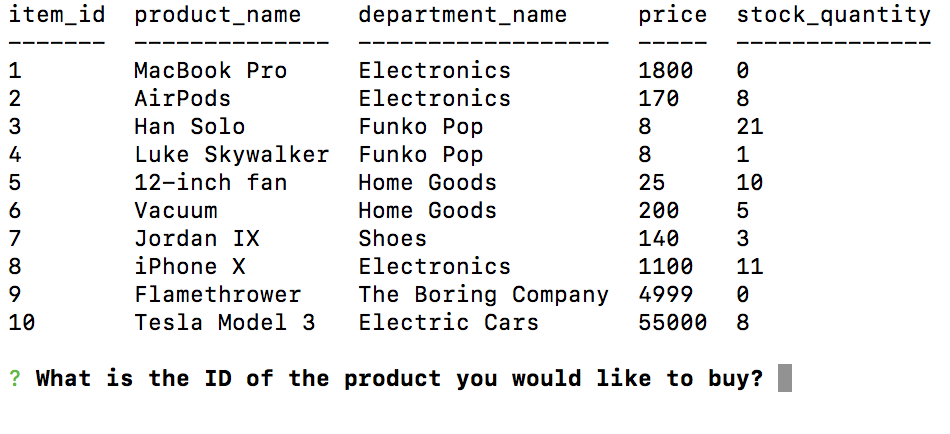

# bamazon
An Amazon-like app that will take in orders from customers and deplete stock from the store's inventory. Powered by MySQL

The app will take in orders from customers and deplete stock from the store's inventory. 

1-Populate this database with around 10 different products. (i.e. Insert "mock" data rows into this database and table).

2-Then create a Node application called bamazonCustomer.js. Running this application will first display all of the items available for sale. Include the ids, names, and prices of products for sale.

3-The app should then prompt users with two messages.
  -The first should ask them the ID of the product they would like to buy.

-The second message should ask how many units of the product they would like to buy.

1-Once the customer has placed the order, your application should check if your store has enough of the product to meet the customer's request.
  -If not, the app should log a phrase like Insufficient quantity!, and then prevent the order from going through.
1-However, if your store does have enough of the product, you should fulfill the customer's order.
  -This means updating the SQL database to reflect the remaining quantity.
  -Once the update goes through, show the customer the total cost of their purchase.

